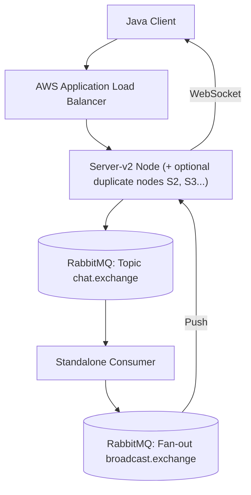
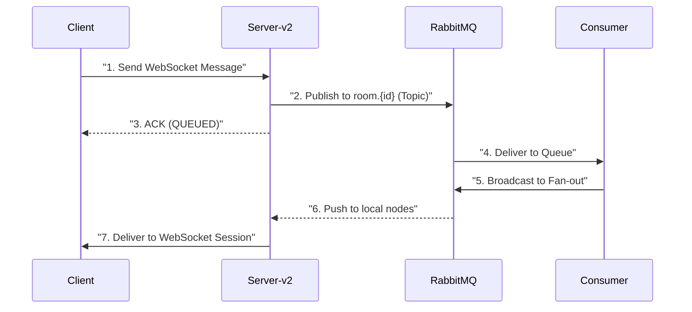
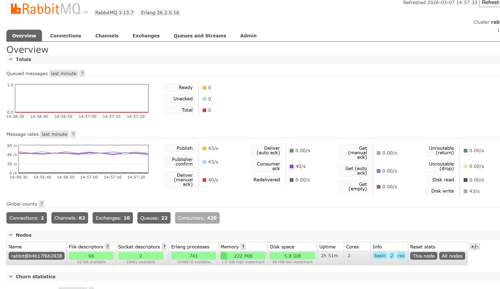

# CS6650 Assignment 2 — Design Document: Distributed WebSocket Chat System

## Git Repository
https://github.com/StarfishJ/Distributed-System-Assignment-1.git

## 1. System Architecture
Our architecture utilizes a decoupled, event-driven pattern to achieve horizontal scalability. Servers handle WebSocket I/O via Netty, while a standalone Consumer layer manages global broadcast logic via RabbitMQ.

### [Diagram 1: System Overview]

---

## 2. Message Flow Sequence
Each message undergoes a "Two-Hop" delivery to ensure all users in a room receive it, regardless of which server they are connected to.

---

## 3. Queue Topology & Consumer Threading

### Queue Design
- **Topic Exchange (`chat.exchange`)**: Handles ingress messages. Routing key: `room.{roomId}`.
- **20 Room Queues**: Unlimited rooms are mapped to 20 durable queues using a **Hashing Strategy**. (`room.{id % 20}`).
- **Room ID Preservation**: Crucially, the original [roomId](cci:1://file:///d:/6650/assignment%201/server-v2/src/main/java/server/ChatWebSocketHandler.java:41:4-47:5) is preserved within the message payload. When the Consumer broadcasts the message, server nodes use this payload [roomId](cci:1://file:///d:/6650/assignment%201/server-v2/src/main/java/server/ChatWebSocketHandler.java:41:4-47:5) to deliver messages to the correct WebSocket sessions, allowing any number of rooms to coexist without collision. 
- **Fan-out Exchange (`broadcast.exchange`)**: Distributes valid messages to all server nodes.

### Consumer Threading Model
- **Thread-to-Queue Affinity**: The Consumer uses a pool of 20 concurrent threads.
- **Isolation**: Each thread is pinned to a specific room queue (`prefetch=1`). This guarantees **strict message ordering** within each room while allowing parallel processing across rooms.

---

## 4. Load Balancing & Failure Handling

### Load Balancer Configuration
- **AWS ALB**: Handles WebSocket protocol upgrade and terminates TLS (if applicable).
- **Sticky Sessions**: Enabled via duration-based cookies to ensure a client stays on the same server node for the duration of the stateful WebSocket handshake.

### Failure Handling & Resilience
**Circuit Breaker & Backpressure**
-implemented a robust fail-fast mechanism using **Resilience4j**. If RabbitMQ becomes unresponsive (e.g., during AWS EBS throttling), the **Circuit Breaker** trips to the `OPEN` state.
- **Server Logic**: Instead of dropping messages or blocking, the server immediately responds with `{"status":"ERROR","message":"SERVER_BUSY"}`.
- **Client Resilience**: The Java client detects this specific error and performs an `offerFirst()` re-queue, ensuring **at-least-once delivery** despite physical hardware limitations.

- **Deduplication**: The Consumer uses a **Caffeine Cache** (LRU) to drop duplicate `UUIDs` that may arise during network retries or RabbitMQ redeliveries.
- **Graceful Shutdown**: All nodes use Spring's graceful shutdown (30s timeout) to ensure in-flight AMQP ACKs are processed before the process exits.

---

### Performance Results
#### Single Server Node Baseline
- **Aggregate Throughput**: ~3,506 msg/s
- **Peak Rate**: ~4,800 msg/s
- **Success Rate**: **100.00%** (500,000 messages)
- **Survival**: Successfully survived AWS EBS I/O credit exhaustion via Backpressure logic.

#### Two Server Nodes

The throughput increased from 3506 msg/s to 3587 msg/s, which is an improvement of about 2.3%. The latency decreased from 206.39 ms to 149.87 ms, which is an improvement of about 27.4%.

#### Four Server Nodes

Performance improvement analysis:
The throughput is 3585 msg/s, which is virtually identical to the 2-node setup (3587 msg/s). This confirms that the system's performance is currently capped by **RabbitMQ's Disk I/O (EBS credits)** on the single-node broker, rather than the number of server nodes. However, the 4-node configuration provides significantly higher CPU headroom and resilience.

#### 100-Room Scalability Validation
- **Goal**: Verify if the system handles room-to-queue collisions correctly when logic rooms exceed physical queues.
- **Test Case**: 500,000 messages distributed across 100 logical rooms (mapped to 20 physical queues) with 64 worker threads.
- **Result**: **100.00% Success Rate**, Throughput ~3,220 msg/s.
- **Conclusion**: Confirmed that the hashing strategy and `roomId` preservation in the payload ensure perfect delivery even under high contention and room collisions.

### Configuration Detail
#### Queue configuration parameters
- **Room Queues**: 20 durable physical queues (`room.1` - `room.20`) used for sharding logic rooms via hashing (`roomId % 20`).
- **TTL (Time To Live)**: 5,000ms (Messages expire after 5 seconds to prevent memory overflow)
- **Max Length**: 1,000 messages per queue (Drop-head overflow policy)
- **Dead Letter Exchange**: `chat.dlx` for failed/expired messages.
- **Persistence**: Messages are marked persistent for durability.

#### Consumer configuration
- **Concurrency**: 20 (Fixed 1 thread per Room queue to ensure strict ordering)
- **Prefetch Count**: 1 (Ensures fair distribution and prevents message bunching)
- **Acknowledge Mode**: Manual (ACK sent only after successful processing/broadcast)
- **Idempotency**: Caffeine cache (10 min expiry) to deduplicate broadcast IDs.

#### ALB settings
- **Idle Timeout**: 4,000 seconds (To maintain long-lived WebSocket connections)
- **Stickiness**: Enabled (Load balancer generated cookie, duration: 86,400s)
- **Protocol**: HTTP (Port 80) mapped to backend 8080.
- **Health Check**: `GET /health` (Interval: 30s, Timeout: 5s, Threshold: 2)

#### Instance types used
- **Server Nodes**: 1 x `t3.medium` + optional `t3.micro` nodes
- **Consumer Node**: 1 x `t3.small`
- **RabbitMQ Node**: 1 x `t3.medium`
- **Client**: Running on local performance analysis node