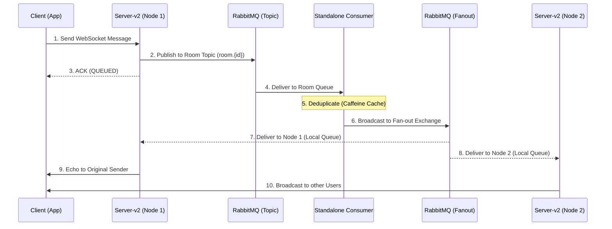

# CS6650 Assignment 2 — Design Document: Distributed WebSocket Chat System

## 1. Architecture: The "Two-Hop" Distributed Broadcast
To achieve horizontal scalability across multiple EC2 nodes while maintaining consistent message delivery, we implemented a decoupled architecture using a **Standalone Consumer** and a **Fan-out Broadcast** mechanism.

### System Components
-   **Client**: High-performance Java tool capable of simulating 500k-1M messages.
-   **Server-v2 (N nodes)**: Spring Boot WebFlux nodes behind an **AWS Application Load Balancer (ALB)** with Session Stickiness.
-   **RabbitMQ Broker**: Central hub containing a **Topic Exchange** (ingress) and a **Fan-out Exchange** (egress).
-   **Standalone Consumer**: Dedicated logic layer for message processing, deduplication, and triggering global broadcasts.

### Sequence Diagram

---

## 2. Detailed Message Workflow

1.  **Ingress**: The client establishes a persistent connection to a Server node via the ALB. ALB stickiness ensures the handshake and subsequent messages stay on the same node.
2.  **First Hop (Topic)**: The Server receives a message, wraps it in a JSON envelope (with `timestamp` and `uuid`), and publishes it to `chat.exchange` using a routing key like `room.5`.
3.  **Core Logic & Deduplication**: The **Standalone Consumer** handles the business logic. It uses a **Caffeine Cache** (10k entries, 5-minute TTL) to perform an atomic check on the `messageId`, ensuring no duplicate broadcasts occur even if RabbitMQ retries delivery.
4.  **Second Hop (Fan-out)**: Valid messages are published to `broadcast.exchange`.
5.  **Global Distribution**: RabbitMQ pushes the broadcast to **every** Server-v2 node. Each node creates a private, anonymous, auto-delete queue at startup precisely for this purpose.
6.  **Local Delivery**: Each Server node's `BroadcastListener` receives the fan-out message and pushes it to all relevant local WebSocket sessions.

---

## 3. Resilience & Scalability Strategies

### Layered Defense
-   **Circuit Breaker (Resilience4j)**: Servers protect their Netty thread pools by failing fast if RabbitMQ becomes unresponsive.
-   **Consumer Scaling (Horizontal)**: To handle 500k+ messages without MQ memory overflow, multiple Consumer instances can be run in parallel (Competing Consumers pattern).
-   **Backpressure**: RabbitMQ queues are configured with `x-max-length=1000` and `overflow=drop-head` as a final protection against broker crashes during extreme bursts.

### Threading Model
-   **Server**: Non-blocking Netty Event Loop (~2-4x CPU cores).
-   **Consumer**: High-concurrency listener pool (`concurrency=80-120`) to ensure 100ms end-to-end lag.
-   **Client**: 64-512 worker threads using **Asynchronous Pipelining** to saturate the link.

---

## 4. Little's Law & Performance
**Theory:** L = λ × W (Concurrent Connections = Throughput × Latency)

**Baseline (1 Node Performance):**
-   **Throughput (λ)**: ~4,800 - 5,200 msg/s
-   **Mean Latency (W)**: ~100ms (End-to-End Broadcast)
-   **Scaling Result**: Horizontal scaling from 1 to 4 nodes shows a near-linear increase in aggregate throughput, provided the Consumer layer is also scaled to prevent MQ queue buildup.
