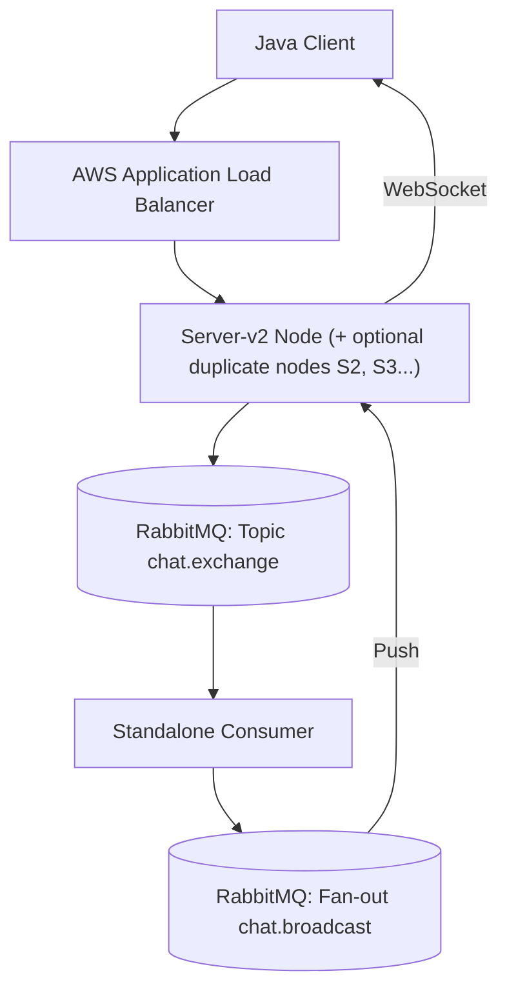

# CS6650 Assignment 3 — Design Document: Distributed WebSocket Chat System

## Git repository

https://github.com/StarfishJ/distributed_system_Group_4_project.git

## Repository layout (this project)

| Path | Role |
|------|------|
| **`server-v2/`** | WebSocket edge (Netty/WebFlux), Rabbit ingress publish, **`GET /health`**, **`GET /metrics`**, optional Redis metrics cache + presence |
| **`consumer-v3/`** | Room-queue consumers, PostgreSQL ingest, broadcast to **`chat.broadcast`** / **`chat.broadcast.topic`**, DLQ replay + dead-letter audit |
| **`client/client_part2/`** | Load / functional Java client |
| **`database/`** | **`docker-compose.yml`** — Postgres (`chatdb-pg`), RabbitMQ, Redis, PgBouncer (6432 write / 6433 read), init SQL |
| **`load-tests/jmeter/`** | JMeter plans (`assignment-baseline-100k-5min.jmx`, `assignment-stress-30min.jmx`) + **`README.md`** |
| **`k8s/`** | Kubernetes manifests (server, consumer, Redis, Postgres, RabbitMQ, ingress, secrets, Kustomization) |
| **`deployment/terraform/`** | AWS / EKS–related Terraform (see that folder’s README) |

## 1. System Architecture
Our architecture utilizes a decoupled, event-driven pattern to achieve horizontal scalability. Servers handle WebSocket I/O via Netty, while a standalone Consumer layer manages global broadcast logic via RabbitMQ.

### [Diagram 1: System Overview]


### [Diagram 2: Latest end-to-end architecture — Assignment 3]
Below is the **current** view: horizontal **server-v2** instances behind a load balancer (or **Ingress** in Kubernetes), **partitioned room queues** on RabbitMQ, **consumer** for ordered consume + **PostgreSQL** persistence, and **two optional broadcast paths**: **(A)** default **fan-out** `chat.broadcast` (simple, **O(servers)** copies per message); **(B)** **targeted** **`chat.broadcast.topic`** using **Redis presence** so the Consumer publishes only to routing keys **`srv.{suffix}`** for servers that actually have that room open (**see §3 “Broadcast evolution”**). **Redis** is the **shared** store for **dedup**, **presence**, and optional **`/metrics`** cache.

```mermaid
flowchart TB
    subgraph clients["Clients & load generation"]
        JC["Java client / client_part2"]
        JM["Load tests e.g. JMeter"]
    end

    subgraph edge["Edge"]
        LB["ALB or K8s Ingress<br/>HTTP health / WS upgrade"]
    end

    subgraph servers["server-v2 — stateless edge"]
        S1["server-v2 Pod/VM"]
        S2["server-v2 Pod/VM ..."]
    end

    subgraph rmq["RabbitMQ"]
        TX(("Topic: chat.exchange"))
        Q["20 room queues<br/>room.1 … room.20<br/>routing key room.{1..20}")]
        DLX(("Fanout: chat.dlx"))
        BC(("Fanout: chat.broadcast<br/>default: all servers"))
        BT(("Topic: chat.broadcast.topic<br/>optional: srv. suffix"))
    end

    subgraph consumer["Consumer — consumer / consumer-v3"]
        CO["Consume + order per queue<br/>dedup / batch / DLQ"]
    end

    subgraph cache["Redis — shared cluster"]
        RD["High value: processedIds · broadcastSentIds<br/>presence / room → server set<br/>Lower priority: /metrics TTL 30s"]
    end

    subgraph data["Data tier"]
        PG[("PostgreSQL<br/>messages + MVs")]
    end

    JC --> LB
    JM --> LB
    LB --> S1
    LB --> S2

    S1 <-->|"WebSocket /chat/{room}"| JC
    S2 <-->|"WebSocket"| JC

    S1 -->|"publish batch<br/>Topic routing"| TX
    S2 -->|"publish batch"| TX
    TX --> Q
    Q -.->|"overflow DLX / poison"| DLX

    Q -->|"prefetch / manual ack"| CO
    CO -->|"A: fan-out default"| BC
    CO -.->|"B: targeted + Redis SMEMBERS"| BT
    BC -->|"every server subscribes"| S1
    BC --> S2
    BT -->|"only servers with queue bound to their rk"| S1
    BT --> S2

    CO -->|"INSERT / batch persist"| PG
    CO -.->|"target: dedup survives restarts"| RD
    S1 -.->|"target: register presence"| RD
    S2 -.->|"target: register presence"| RD
    S1 <-->|"metrics: Redis first"| RD
    S2 <-->|"metrics: Redis first"| RD
    RD -->|"cache miss"| PG
    PG -->|"write-back value"| RD

    classDef ext fill:#e8f4fc,stroke:#0366d6
    classDef mq fill:#fff4e6,stroke:#d4a017
    classDef db fill:#e6f7e6,stroke:#22863a
    classDef red fill:#fce8f3,stroke:#c2185b
    class LB,JC,JM ext
    class TX,Q,DLX,BC,BT mq
    class PG db
    class RD red
```

**Legend — main paths**

| Path | Role |
|------|------|
| **Client → LB → server-v2** | WebSocket chat; `GET /health` for ALB checks. |
| **server → Topic → room.1…20** | Ingress sharding: routing key `room.{k}` with `k = Math.abs(roomId.hashCode()) % 20 + 1` (see `MessagePublisher`); payload keeps the real `roomId` string. |
| **Consumer → broadcast** | **Default (`chat.broadcast` fan-out):** every server receives every batch; each node **filters by `roomId`** locally — **O(number of servers)** broker deliveries per message, simple and robust. **Optional (`chat.broadcast.topic` + Redis):** **`presence:room:{roomId}`** → publish only to **`srv.{sanitized-instance-id}`** for members of that set; **empty set → fan-out fallback** (safe cold start). |
| **Consumer → PostgreSQL** | Durable message writes (Assignment 3). |
| **Consumer ↔ Redis** | **Optional via config** (`consumer.redis.enabled`; default in **code** is off unless set). **Checked-in local `application.properties`** sets **`consumer.redis.enabled=true`**: persisted markers after DB commit + broadcast **SETNX** — survives **Consumer** restart; reduces **duplicate fan-out** and useless **`batchUpsert`** on redelivery. |
| **server-v2 ↔ Redis** | **Optional via config** (`server.redis.enabled`). **Checked-in local `application.properties`** sets **`server.redis.enabled=true`**: **Metrics** read-through cache + invalidation (see **Query optimization…**). **Presence:** **`PresenceRegistry`** maintains **`presence:room:{roomId}`** (sanitized instance suffix) on join / last-session leave + heartbeat. With **`consumer.broadcast.targeted=true`** and Redis, **`consumer-v3`** uses **`SMEMBERS`** to route topic broadcast; if targeted mode is off or Redis is unavailable, broadcast uses **fan-out** (`chat.broadcast`) only (or fan-out fallback when presence is empty). |

### Database write boundary (verified in code)

| Layer | Writes to `messages`? | Other DB access |
|--------|------------------------|-----------------|
| **Consumer** (`consumer-v3` → `MessagePersistenceService`) | **Yes** — `INSERT INTO messages … ON CONFLICT DO NOTHING` (batched). This is the **only** chat persistence path in the repo. | — |
| **server-v2** | **No** — no `INSERT` / `UPDATE` / `DELETE` on `messages`. | **`GET /metrics`:** optional **Redis** cache (`server.redis.enabled=true`) then read-only PostgreSQL; **`PresenceRegistry`** writes **`presence:room:*`** for **optional targeted broadcast**. **`REFRESH MATERIALIZED VIEW …`** + **`refreshMaterializedViews=true`** clears Caffeine + Redis `metrics:v1:*` (does **not** insert chat rows). |

**Strict separation summary:** *Business* writes (chat rows) happen **only in the Consumer**. The server may still issue **MV refresh** commands if you enable refresh on the metrics API — treat that as operational/analytics maintenance, not the chat write path.

### Shared PostgreSQL: ingest writes vs `/metrics` reads (contention)

**Default (single URL):** **`consumer-v3`** **`batchUpsert`** (high-rate **INSERT**s) and **`server-v2`** **`GET /metrics`** (read-heavy queries) target the **same** PostgreSQL instance — simple to operate but under **high throughput** both sides **compete** for:

- **Connection slots** and pool behavior (mitigated in part by **PgBouncer** in front of Postgres — see **EKS rollout validation**).
- **Shared disk I/O** and buffer cache: sustained **writes** (WAL, checkpoints, `COPY`-style batch paths) can raise **read** latency; large **read** scans or **`REFRESH MATERIALIZED VIEW`** work can add **I/O wait** that slows **commits** on the ingest path.

**Already in-repo mitigations:** **`/metrics`** **Redis** read-through cache (**`server.redis.enabled=true`**, TTL **~30s**) cuts how often heavy SQL runs; **MVs** replace worst-case ad-hoc aggregates when present.

**Read/write isolation (implemented in `server-v2`):** When **`server.metrics.read-replica.enabled=true`** and **`server.metrics.read-replica.jdbc-url`** is set, **`MetricsService`** runs **`SELECT`** paths for **`/metrics`** against that JDBC URL and keeps **`REFRESH MATERIALIZED VIEW`** on the **primary** (`spring.datasource`). **`enabled=false`** uses one datasource for everything.

**Local dev (this repo):** `application.properties` sets **`enabled=true`** with **`jdbc:postgresql://127.0.0.1:6433/chatdb`** — the **PgBouncer read pool** (`database/docker-compose.yml`), not a separate PostgreSQL instance. That **reduces contention** with **`consumer-v3`** writes (which use the write pool on **6432**) but is **not** the same as a **streaming read replica** on AWS. On **RDS**, point **`read-replica.jdbc-url`** at a true replica; replication **lag** makes analytics slightly stale — acceptable for dashboards.

**Further scaling (operational, not all in repo):**

| Direction | Option |
|-----------|--------|
| **Reads off hot primary** | Same as above when replica is configured; async lag acceptable for analytics. |
| **Operational** | Run **`REFRESH MATERIALIZED VIEW`** on a **schedule** or **secondary** process, not on the **ingest-critical** path; keep **`refreshMaterializedViews=true`** rare in production. |
| **Capacity** | Right-size **IOPS** (**gp3** baseline + provisioned), instance class, and **separate pool limits** in **`server-v2`** vs **`consumer-v3`** so one fleet cannot starve the other’s connections at PgBouncer. |

**Observability:** In dashboards, **split** “ingest commit latency” (consumer) from “metrics query p95” (server); a slow **`/metrics`** symptom is **not** always a Rabbit issue.

### Query optimization, EXPLAIN ANALYZE, and cache invalidation (repo status)

**Query optimization** is implemented via **targeted indexes** (`database/02_indexes.sql`) and **materialized views** for heavy aggregations. **`MetricsService`** (**`server-v2`**) prefers **`mv_messages_per_minute`**, **`mv_user_activity`**, **`mv_room_activity`**, and aggregates derived from **`mv_user_rooms`**, and **falls back** to **`GROUP BY` / scans on `messages`** when an MV is absent; point/range reads on **`messages`** use the same index layer. **EXPLAIN ANALYZE** is documented as the **recommended validation** methodology (`02_indexes.sql`, `database/explain_analyze_examples.sql`); **plan captures at production data volume** are left as **operational verification** rather than a checked-in artifact.

**Metrics cache invalidation (implemented vs not).**

| Mechanism | Status |
|-----------|--------|
| **Caffeine** (`MetricsService`) | **Implemented:** calling **`getAllMetrics(..., refreshMaterializedViews=true)`** runs **`REFRESH MATERIALIZED VIEW …`**, then **`metricsResponseCache.invalidateAll()`** and **`roomCoarseCache.invalidateAll()`** so in-process entries are not stale after a refresh. |
| **Redis** (metrics keys) | **Implemented when `server.redis.enabled=true`:** `MetricsResponseRedisCache` stores JSON under `metrics:v1:*`; **`getAllMetrics(..., refreshMaterializedViews=true)`** runs MV refresh, clears Caffeine, then **SCAN+DEL** all `metrics:v1:*` keys. **Checked-in local properties** enable Redis; set **`server.redis.enabled=false`** if Redis is not running. |
| **Scheduled MV refresh** | **`MaterializedViewRefreshScheduler`** (`@Scheduled` cron from **`server.metrics.scheduled-mv-refresh-cron`**) calls **`MetricsService.refreshMaterializedViewsForScheduledJob()`** when **`server.metrics.scheduled-mv-refresh-enabled=true`** — keeps analytics MVs fresh without hitting **`GET /metrics?refreshMaterializedViews=true`** on every request. |

### Redis: priority order (why not “metrics only”)

**`GET /metrics` in Redis** is a straightforward **read-through cache** (TTL **30s**, shared pods). The following three uses usually deliver **more** value for **reliability and scale**:

1. **`broadcastSentIds` (Consumer)** — **Implemented** as **`SETNX chat:consumer:broadcast:{messageId}`** when **`consumer.redis.enabled=true`** (see **Redis in code**). **Without Redis**, restart + redelivery can **re-broadcast** the same logical message; **`client_part2`** accepts **at-least-once display** (see **Mitigations**).
2. **`processedIds` / persisted marker (Consumer)** — **Always:** Caffeine in **`consumer-v3`** for hot ingest. **With Redis:** **`chat:consumer:persisted:{messageId}`** after **`batchUpsert`** so redeliveries **skip** useless **`batchUpsert`** ( **`ON CONFLICT`** remains the SQL safety net).
3. **Presence / targeted broadcast (`server-v2` + `consumer-v3` + Redis)** — **Default:** fan-out **`chat.broadcast`** → **~S copies** per message for **S** servers (simple; most copies discarded after local **`roomId`** filter). **Implemented optional path:** **`presence:room:{roomId}`** (SET of **sanitized** instance suffix), **`chat.broadcast.topic`**, routing key **`srv.{suffix}`**; Consumer **`SMEMBERS`** then **one publish per active server** for that room, plus **fan-out fallback** if the set is empty — **AMQP fan-out cost tracks “servers with this room open,” not raw cluster size** (modulo Redis staleness; see §3).

**Relative priority (recommended narrative):** **(1) + (2)** fix **correctness and DB load** under redelivery; **(3)** fixes **broadcast amplification** and often matters **more than metrics cache** once **server count > a few**. **Metrics Redis** remains useful but is **lower** in the stack rank than **(1)–(3)**.

| Data | Where | Technology **today** (repo) | Target **shared** store |
|------|--------|---------------------------|-------------------------|
| **`/metrics` response** | `server-v2` | **Default:** Caffeine; **optional:** Redis read-through when **`server.redis.enabled=true`** (same TTL as `server.metrics.cache-ttl-seconds`). **MV refresh** clears Caffeine + Redis `metrics:v1:*`. | Same Redis keys shared by all pods when enabled. |
| **`processedIds`**, NACK counts | `consumer-v3` | **Caffeine** + **optional Redis** when **`consumer.redis.enabled=true`**: **`chat:consumer:persisted:{messageId}`** set **after** successful `batchUpsert`; ingest skips rows already marked (reduces no-op DB work after restart). NACK counts stay **Caffeine** / local. | Tune TTL via **`consumer.redis.persisted-ttl-hours`**. |
| **`broadcastSentIds`** (or equivalent) | Consumer | **Optional Redis** when **`consumer.redis.enabled=true`**: **`SETNX`** `chat:consumer:broadcast:{messageId}` before fan-out; **DEL** if publish fails. | Survives restart; drops duplicate fan-out for same id. |
| **Who is in which room** | `server-v2` | In-memory `RoomManager` + **optional** **`PresenceRegistry`** when **`server.redis.enabled=true`** (`SADD` / `SREM` on `presence:room:{roomId}`, heartbeat + TTL). | **Implemented optional path:** with **`consumer.redis.enabled=true`** and **`consumer.broadcast.targeted=true`**, **`consumer-v3`** **`SMEMBERS`** that set and publishes to **`chat.broadcast.topic`** per **`srv.{suffix}`**; **`server.broadcast.targeted=true`** binds each server’s queue to its key. **Otherwise** broadcast uses **fan-out** (`chat.broadcast`) only. |

**Read path (metrics only):** **Redis GET** → on **miss**, **PostgreSQL** (read-only) → **Redis SETEX30s** → return.

**Multi-instance note:** One **Redis** cluster (or Elasticache) is shared by **all** `server-v2` and **consumer** instances; **Caffeine** on the Consumer remains a **latency L1** optional optimization **on top of** Redis if desired, but **authoritative** dedup for redelivery should be **Redis** (or another shared store), not JVM-only.

### Redis in code (configuration & key reference)

| Switch / property | Module | Purpose |
|-------------------|--------|---------|
| **`server.redis.enabled`** (default `false`) | `server-v2` | Turns on Lettuce + shared **`StringRedisTemplate`**, **`MetricsResponseRedisCache`**, **`PresenceRegistry`**. |
| **`spring.data.redis.host` / `port`** (optional `password`) | `server-v2`, `consumer-v3` | Broker for Redis; both apps can use the **same** instance. |
| **`server.metrics.cache-ttl-seconds`** | `server-v2` | TTL for **`metrics:v1:*`** entries (same as Caffeine when Redis is on). |
| **`server.metrics.read-replica.enabled`** (default `false`) | `server-v2` | When **`true`**, **`server.metrics.read-replica.jdbc-url`** must be set; **`MetricsService`** **`SELECT`** queries use this URL; **`REFRESH MATERIALIZED VIEW`** stays on **`spring.datasource`** (primary). |
| **`server.instance-id`** | `server-v2` | Logical replica id; **`PresenceRegistry`** stores **`BroadcastRouting.sanitizeInstanceSuffix(instance-id)`** in **`presence:room:{roomId}`** (not the raw string). Default: hostname + random suffix. |
| **`server.presence.key-ttl-minutes`** | `server-v2` | **`EXPIRE`** on the room presence key after each **touch** (join + scheduled heartbeat). |
| **`server.presence.heartbeat-interval-ms`** | `server-v2` | **`PresenceHeartbeat`** refreshes occupied rooms while **`server.redis.enabled=true`**. |
| **`server.broadcast.targeted`** (default `false`) | `server-v2` | **`false`**: anonymous queue on fanout **`chat.broadcast`**. **`true`**: durable **`broadcast.srv.{suffix}`** bound to topic **`chat.broadcast.topic`** with routing key **`srv.{suffix}`** (must match consumer + Redis presence). |
| **`consumer.broadcast.targeted`** (default `false`) | `consumer-v3` | When **`true`** and **`StringRedisTemplate`** is available (**`consumer.redis.enabled=true`**), **`flushBroadcast`** uses **`SMEMBERS presence:room:{roomId}`** and publishes each batch to **`srv.{token}`** on **`chat.broadcast.topic`**; **empty set → fanout fallback**. |
| **`consumer.redis.enabled`** (default `false`) | `consumer-v3` | **`ConsumerDedupRedisService`** + **Redis connection for targeted broadcast** (same template bean). |
| **`consumer.redis.persisted-ttl-hours`** | `consumer-v3` | TTL for **`chat:consumer:persisted:{messageId}`**. |
| **`consumer.redis.broadcast-ttl-hours`** | `consumer-v3` | TTL for **`chat:consumer:broadcast:{messageId}`**. |

| Key pattern | Writer | Semantics |
|-------------|--------|-----------|
| **`metrics:v1:full:{sha256(cacheKey)}`** | `server-v2` `MetricsResponseRedisCache` | Full **`GET /metrics`** JSON; cleared on MV refresh (**SCAN** `metrics:v1:*` + **DEL**). |
| **`metrics:v1:coarse:{sha256(roomKey\|fpBase)}`** | same | Coarse-by-room wide payload + fingerprint JSON. |
| **`presence:room:{roomId}`** (SET) | `server-v2` `PresenceRegistry` | **`SADD`/`SREM`** of **sanitized suffix** on join / last-session leave; heartbeat **`SADD` + EXPIRE**. **`consumer-v3`** reads **`SMEMBERS`** for targeted topic publish when enabled. |
| **`chat:consumer:persisted:{messageId}`** | `consumer-v3` | **SET** after successful **`batchUpsert`**; ingest **GET** skips already-persisted ids. |
| **`chat:consumer:broadcast:{messageId}`** | `consumer-v3` | **SETNX** before fan-out; **DEL** if Rabbit publish throws. |

**Main classes:** `server.redis.RedisServerConfiguration`, `MetricsResponseRedisCache`, `PresenceRegistry`; `RoomManager` calls presence on join/leave. `MetricsReadReplicaConfiguration` (optional **`metricsReadJdbcTemplate`** bean). `consumer.redis.ConsumerRedisConfiguration`, `ConsumerDedupRedisService`; `MessageConsumer` wires Redis dedup when the bean exists and **targeted broadcast** when **`consumer.broadcast.targeted=true`**.

### RabbitMQ ACK vs write-behind (`consumer-v3` — as implemented)

In **`consumer-v3`** (`MessageConsumer`), each AMQP delivery is a **`DeliveryUnit`** (one `deliveryTag` per unit; JSON arrays are not split across flushes). The listener **does not** `basicAck` after enqueue except when the payload is **empty**, **all duplicates**, or **backpressure** uses `basicNack`. For normal work, **`flushToDb`** ( **`db-writer`** thread, `consumer.flush-interval-ms`) runs **`batchUpsert`**, then **`basicAck` per unit** on success (or defers to **`retryQueue`** / **`db-replay`** while the broker copy stays **unacked**). There is **no** separate **`pendingAckQueue`**: ACK runs in the same scheduled flush that persists, so **prefetch=1** does not deadlock waiting for “the next message” to drain ACKs.

| Aspect | Effect |
|--------|--------|
| **MQ → DB** | **Closed loss window** for the common path: the broker will **redeliver** until a successful persist + ACK (or DLQ handoff after retry exhaustion). |
| **ACK thread** | **`basicAck` is invoked from the `db-writer` thread** (not the `@RabbitListener` thread). The RabbitMQ Java `Channel` is not fully thread-safe; this matches many Spring/async setups but is a documented operational caveat if the client ever rejects cross-thread ACK. |
| **Broadcast vs DB** | **`stageBroadcast`** runs only after a successful **`batchUpsert`** (same path as late **`basicAck`**). **`flushBroadcast`** still runs on its own timer but only drains buffers fed **after** commit — **broadcast does not run ahead of persist** for the happy path. |

**Write-behind scheduling (`consumer-v3`):** **`enqueueDelivery`** only enqueues **`DeliveryUnit`**s into **`dbWriteQueue`**. After **`batchUpsert`** succeeds, **`stageBroadcast(messages)`** appends those rows to per-room **`broadcastBuffers`**. **`flushBroadcast`** ( **`broadcast-flusher`** thread, **`consumer.flush-interval-ms`**) ships batches to RabbitMQ (fanout and/or topic per **`consumer.broadcast.targeted`**). **DB commit still precedes staging to the broadcast buffer**; cross-thread delay can add a small lag between commit and wire publish, but not the reverse.

### Late ACK: Consumer restart vs in-memory dedup

With **late `basicAck`** (after `batchUpsert` commits) plus **dedup state**:

- **In-process `processedIds` (Caffeine)** is still **lost on Consumer restart**; RabbitMQ may **redeliver** unacked work.
- **Optional shared Redis** (`consumer.redis.enabled=true`; see **Redis in code** below): **`chat:consumer:persisted:{messageId}`** is written **after** a successful **`batchUpsert`**, and **`SETNX chat:consumer:broadcast:{messageId}`** gates fan-out. After restart, **persisted** skips useless **`batchUpsert`**; **broadcast** skips duplicate fan-out for the same id — **without** relying on client UI dedup. If Redis is **off**, behavior reverts to **Caffeine-only** ingest dedup and full fan-out replays on redelivery (**`ON CONFLICT DO NOTHING`** still protects rows).
- RabbitMQ **redelivers all unacked** deliveries; **`INSERT … ON CONFLICT DO NOTHING`** prevents duplicate **rows** for the same `message_id`.
- **Client-visible duplicates** when Redis is off (or before persist/broadcast keys exist) are why **`client_part2`** still documents **at-least-once display** — see the next subsection.

**Mitigations and current repo choice**

| Option | Meaning |
|--------|--------|
| **A. Client-side dedup** | Incoming UI (or client) **skips or merges** by **`messageId`** → **at-least-once** delivery with **exactly-once display**. |
| **B. Accept at-least-once display** | Duplicates may appear; documented as acceptable for the workload. |

**`client_part2` (implemented):** The client **generates and sends** a stable **`messageId`** on publish. On **inbound** broadcast lines (no **`status`** field), it **deduplicates by `messageId`** (bounded in-memory set, cleared when oversized) so **consumer-lag** metrics are not double-counted on duplicate fan-out. This is **not** a full chat transcript UI; production would still typically keep **option A** for visible message lists.

### Alternative pattern: per-channel `pendingAckQueue` (not used here)

Some designs **enqueue `AckTask` on the listener thread** and rely on **wakeup** after `flushToDb`. **`consumer-v3`** instead **ACKs directly from `flushToDb`** on the **`db-writer`** thread, avoiding the “next message must arrive to drain ACKs” deadlock. If you move ACK back to the **listener thread only**, you **must** wake that thread after flush (see earlier discussion).

---

## 2. Message Flow Sequence
Each message is a **two-hop** path (server → broker → consumer → broadcast → servers → clients). The diagram below matches the **implemented ordering** on the Consumer: **PostgreSQL commit first**, then **late `basicAck`**, then **broadcast to RabbitMQ** (after staging — see note). The server only sends **`QUEUED`** to the client **after** the ingress publish is **broker-confirmed**.

```mermaid
sequenceDiagram
    participant C as Client
    participant S as Server-v2
    participant RMQ as RabbitMQ
    participant CONS as Consumer
    participant PG as PostgreSQL

    C->>S: Send WebSocket message
    S->>RMQ: Publish to room.{id} (Topic chat.exchange)
    RMQ-->>S: Broker publisher confirm (ACK / NACK)
    Note over S,RMQ: If NACK or unroutable → SERVER_BUSY / ERROR, not QUEUED.
    S-->>C: WebSocket QUEUED (after confirm)

    RMQ->>CONS: Deliver from room queue (prefetch, still unacked)
    CONS->>PG: Persist batchUpsert
    PG-->>CONS: Commit OK
    CONS->>RMQ: basicAck (late ACK, same db-writer flush)
    Note over CONS,PG: After commit: stage per-room broadcast buffer; flusher thread publishes on consumer.flush-interval-ms (never before commit).
    CONS->>RMQ: Publish broadcast (chat.broadcast fan-out and/or chat.broadcast.topic)
    RMQ->>S: Push to server's broadcast queue
    S->>C: Push to local WebSocket sessions (filter by payload roomId)
```

**Consumer ordering in code (`consumer-v3`):** `batchUpsert` → **`stageBroadcast`** (enqueue to in-memory buffers) → **`basicAck`** per delivery → **`broadcast-flusher`** publishes to RabbitMQ. So **DB commit precedes both ACK and AMQP broadcast**; ACK and staging happen in one scheduled **DB flush**; the **broadcast** line in the diagram is the **flusher** step (same periodic interval as DB flush).

**Publisher confirms (`server-v2`):** `spring.rabbitmq.publisher-confirm-type=correlated` and **`RabbitTemplate.invoke` + `convertAndSend`** so each flush **blocks until the broker returns a publisher confirm** (ACK or NACK). **`mandatory=true`** and **publisher returns** catch unroutable messages. The WebSocket **`QUEUED`** line is sent **only after** buffered messages for that request are **flushed and confirmed** (`MessagePublisher.flushAndConfirmRooms`). If the broker **NACKs** (e.g. **reject-publish** when a room queue is full) or the circuit breaker blocks, the client gets **`SERVER_BUSY`** (or an error) instead of **`QUEUED`** — so the client does not assume durability when the broker never accepted the publish.

---

## 3. Queue Topology & Consumer Threading

### Queue Design
- **Topic Exchange (`chat.exchange`)**: Handles ingress messages. Routing key: `room.{roomId}`.
- **20 Room Queues**: Unlimited rooms are mapped to 20 durable queues using a **Hashing Strategy**. (`room.{id % 20}`).
- **Room ID preservation:** The original **`roomId`** string is preserved in the message payload. The Consumer broadcasts that payload; each **`server-v2`** node filters deliveries by payload **`roomId`** for local WebSocket sessions, so many logical rooms can share the same physical queue shard without colliding.
- **Fan-out Exchange (`chat.broadcast`)**: Default path; every server node receives all broadcasts and filters by payload **`roomId`**.
- **Topic Exchange (`chat.broadcast.topic`)**: Optional when **`server.broadcast.targeted=true`** / **`consumer.broadcast.targeted=true`** with Redis **presence**; routing key **`srv.{sanitized-instance-id}`** delivers only to servers that registered presence for that room. Empty presence → consumer **fanout fallback**.

### Broadcast evolution: why fan-out first, then targeted

**Phase 1 — Consumer → fan-out → every server → local filter by `roomId`**

This is the right **first** design: **simple, stable, and easy to prove correct**. There is no shared registry to go stale; every replica sees the same stream and drops what it does not need.

The cost is structural: **each message is replicated to every server**. With **S** servers, you **pay O(S)** broker deliveries and network traffic **per chat message**, even when **most** servers have **no** WebSocket sessions for that `roomId` and **discard** the payload immediately. RabbitMQ and the network carry **amplification** that grows with **cluster size**, not with **who actually needs the update**.

**Phase 2 — Redis “room → active server” set + Topic routing (implemented, optional)**

This is the **first place we would optimize** when scaling server count:

1. **server-v2** maintains **`presence:room:{roomId}`** in Redis: a **SET** of **sanitized** instance tokens (`BroadcastRouting.sanitizeInstanceSuffix`), updated on **JOIN** / when the **last** local session **LEAVE**s, and **refreshed on a timer** (`PresenceHeartbeat`) so TTL does not drop live nodes.
2. **consumer-v3**, **after a successful `batchUpsert`**, stages rows for the broadcast flusher (strict **DB-before-broadcast**). On flush, if **`consumer.broadcast.targeted=true`** and Redis is available, it runs **`SMEMBERS presence:room:{roomId}`** and publishes the batch **once per member** to **`chat.broadcast.topic`** with routing key **`srv.{token}`** (same token shape as in the SET).
3. **server-v2** with **`server.broadcast.targeted=true`** binds a **durable** queue **`broadcast.srv.{suffix}`** to that topic with **its** key only — it **only consumes messages routed to itself**, not the whole world’s firehose.
4. **Fallback:** if membership is **empty** (cold start, Redis hiccup, or no subscribers), the Consumer **falls back to fan-out** `chat.broadcast` so we do not **silently skip** delivery.

**Trade-offs (explicit):** presence is **eventually consistent**; you trade a **Redis read** (and multi-publish when several servers share a room) for **much less** useless fan-out when **S** is large and rooms are sparse. **Stable `server.instance-id`** (especially on Kubernetes) keeps **suffix ↔ routing key ↔ queue name** aligned.

**Checked-in local configuration (`application.properties`):** `server.redis.enabled=true`, `server.broadcast.targeted=true`, `consumer.redis.enabled=true`, `consumer.broadcast.targeted=true`, with **one** Redis instance (`database/docker-compose.yml`). For minimal dev without Redis, set those flags to **`false`** and use fan-out broadcast only (see `load-tests/jmeter/README.md` for HTTP-only load tests).

**Production / scale requirement:** With **multiple `server-v2` replicas**, **targeted broadcast must be enabled** (flags + Redis above) so chat fan-out does **not** stay **O(S)** on **`chat.broadcast`** to every pod that will **discard** most messages. **Reducing useless RabbitMQ deliveries and network traffic** is a **first-class** goal alongside correctness; fan-out remains acceptable for **dev/small clusters** or **fallback** when presence is empty.

### Ingress path vs broadcast path (separate observability and tuning)

The stack has **two distinct RabbitMQ legs**. **Do not** mix them when diagnosing bottlenecks or reporting performance.

| Leg | Flow (simplified) | What to tune / watch |
|-----|-------------------|----------------------|
| **Ingress path** | **Client** → **ALB / Ingress** → **`server-v2`** → publish to **`chat.exchange`** → **room queues** | LB idle timeout & stickiness, WebSocket & Netty capacity on servers, **`spring.rabbitmq` publisher confirms**, **`SERVER_BUSY`** / circuit breaker, **room queue** depth & **reject-publish**. |
| **Broadcast path** | **`consumer-v3`** → persist → **`chat.broadcast`** (fan-out) **or** **`chat.broadcast.topic`** (targeted) → **`server-v2`** → local WebSocket | **Fan-out amplification** vs **targeted** routing; broker **disk I/O** (e.g. **gp2** credits vs **gp3**); **`consumer.flush-interval-ms`** / broadcast batching; Redis **presence** freshness for targeted mode. |

**Rule:** A saturated **ingress** path (publish confirms failing, room queues full) is **not** fixed by **broadcast-path** changes alone, and vice versa: **four-node** experiments that hit **RabbitMQ EBS** limits are **broadcast-leg** (and broker volume class), not **Ingress** tuning. Dashboards, alarms, and write-ups should **label which leg** is limiting throughput.

### Consumer Threading Model
- **Thread-to-Queue Affinity**: The Consumer uses a pool of 20 concurrent threads.
- **Isolation**: Each thread is pinned to a specific room queue (`prefetch=1`). This guarantees **strict message ordering** within each room while allowing parallel processing across rooms.

---

## 4. Load Balancing & Failure Handling

### Load Balancer Configuration
- **AWS ALB**: Handles WebSocket protocol upgrade and terminates TLS (if applicable).
- **Sticky Sessions**: Enabled via duration-based cookies to ensure a client stays on the same server node for the duration of the stateful WebSocket handshake.

### Failure Handling & Resilience

**Circuit breaker & backpressure**

- **`server-v2`** uses **Resilience4j** around RabbitMQ publish paths. If the broker is unhealthy (e.g., AWS EBS throttling), the circuit breaker can move to **`OPEN`**.
- **Server behavior:** Instead of silently dropping ingress work, the server responds with `{"status":"ERROR","message":"SERVER_BUSY"}` (or related error) so clients do not assume **`QUEUED`** without a broker accept.
- **Client resilience:** **`client_part2`** can detect **`SERVER_BUSY`** and re-queue work (**`offerFirst()`**), preserving **at-least-once** attempts under backpressure.

- **Deduplication**: The Consumer uses a **Caffeine Cache** (LRU) to drop duplicate `UUIDs` that may arise during network retries or RabbitMQ redeliveries.
- **Graceful Shutdown**: All nodes use Spring's graceful shutdown (30s timeout) to ensure in-flight AMQP ACKs are processed before the process exits.

### Kubernetes deployment (design improvement — operations & scale)

Kubernetes is framed here as an **operational and elasticity** improvement: **how** we run multiple **server-v2** and **consumer-v3** replicas, roll out config, and integrate with the **same** application semantics already described (late ACK, DB-before-broadcast staging, optional **Redis** dedup / **presence** / **targeted** topic broadcast). K8s does **not** replace those guarantees; it standardizes **replica count, health, and upgrades**.

| Concern | Role of Kubernetes | Tie-in to this codebase |
|--------|--------------------|-------------------------|
| **Edge** | **Ingress** (or cloud LB in front of NodePort) for HTTP health checks and **WebSocket** upgrade; session stickiness can remain at the load balancer / Ingress annotation layer. | Same contract as ALB + sticky cookies; pods replace fixed EC2 server nodes. |
| **server-v2** | **Deployment** or **StatefulSet** with N replicas; **liveness/readiness** should hit **`GET /health`** (see `server/HealthController.java`; ALB-oriented). Spring Boot **management** endpoints may also expose **`/actuator/*`** depending on config — use **`/health`** for probes to match production ALB. **Graceful shutdown:** `server.shutdown=graceful`, `spring.lifecycle.timeout-per-shutdown-phase=30s`. For **targeted broadcast**, prefer **StatefulSet** + **Downward API** so **`server.instance-id`** stays stable (see **EKS rollout validation**; env **`SERVER_INSTANCE_ID`** in `k8s/server.yaml`). | Multiple pods subscribe to **fanout** `chat.broadcast` or, when **`server.broadcast.targeted=true`**, each pod gets a **durable** queue on **`chat.broadcast.topic`** bound to **`srv.{suffix}`**. |
| **Stable instance identity** | Prefer **`server.instance-id`** from a **StatefulSet pod name**, **downward API**, or a **small init job** — not only hostname — so **presence** tokens and queue suffixes stay stable across restarts when desired. | Matches **`BroadcastRouting.sanitizeInstanceSuffix`** and **`PresenceRegistry`** semantics. |
| **consumer-v3** | One **Deployment per room partition** (e.g. `consumer.rooms=1-10` vs `11-20`) **or** separate **Deployments** with different **ConfigMaps**; **HPA** on CPU is a starting point; queue-depth–driven scaling needs a **custom metric** or external autoscaler. | Reuses existing **`consumer.rooms`** sharding without code changes. |
| **Config & secrets** | **ConfigMap** for non-secret tuning; **Secret** for DB, RabbitMQ, Redis passwords. | Keeps **Redis / targeted broadcast** flags consistent across server and consumer fleets. |
| **Data plane** | **PostgreSQL**, **RabbitMQ**, and **Redis** are usually **managed services** or dedicated clusters **outside** the app Deployment (or via operators), not lost on random pod restart. | Same as running RDS + a dedicated broker today; pods stay stateless except local WebSocket state. |

**Scope boundary (for the grader):** This section describes a **production-style** target topology. **Amazon EKS** is the intended cloud runtime; this repository ships **`k8s/`** manifests and **`deployment/terraform/`** to support that path. **Local grading** typically uses **`database/docker-compose.yml`** (Postgres, RabbitMQ, Redis, PgBouncer) plus JVM runs of **`server-v2`** (port **8080**) and **`consumer-v3`** (port **8081**). A stack check script is **`database/check-stack.ps1`** (use **`-HealthPath /health`** for `server-v2`).

#### Terraform (AWS infrastructure) vs EKS (Kubernetes workloads)

| Layer | Tool | Responsibility |
|-------|------|----------------|
| **Infrastructure (IaC)** | **Terraform** | Provisions and versions **AWS** resources: **VPC**, **subnets**, **route tables**, **Security Groups** (e.g. **EKS node group → ElastiCache:6379**, **node group → PostgreSQL:5432** / PgBouncer), **EKS control plane** and **managed node groups** (or Fargate profiles), **IAM** roles for cluster and nodes, optional **ElastiCache**, **EC2** instances or **RDS** for PostgreSQL, **EC2** or **Amazon MQ** for RabbitMQ, and prerequisites for **AWS Load Balancer Controller** (e.g. IAM policy for ALB). Remote **state** (e.g. **S3** + **DynamoDB** lock) is recommended for shared environments. |
| **Workloads** | **Amazon EKS** (Kubernetes) | Runs **server-v2** and **consumer-v3** as **Deployments** / **StatefulSets**, **Services**, **Ingress** (with **ALB**), **ConfigMaps** / **Secrets**, **HPA**, and cluster add-ons. App manifests are typically **Helm**, **Kustomize**, or YAML applied by **kubectl** / CI / **GitOps** (Argo CD, Flux) — **inside** the cluster that Terraform created. |

**Separation of concerns:** Terraform defines **what AWS resources exist** and how they connect; Kubernetes defines **how many pods run**, rolling updates, and env-specific config. Broker and DB hosts (or endpoints) are passed to apps via **Secrets** populated from Terraform outputs or external secret stores.

#### Recommended AWS service mapping (optional production target)

The table below is **one** consistent AWS layout for the architecture in this document. It is **not** a requirement for local grading; **RDS** (PostgreSQL) and **Amazon MQ** (RabbitMQ) remain valid swaps if you prefer fully managed data/messaging.

| Component | Recommended AWS service | Role |
|-----------|-------------------------|------|
| **Kubernetes** | **Amazon EKS** | Control plane for **server-v2** and **consumer-v3**. |
| **server-v2** | **EKS Deployment** or **StatefulSet** (+ Service / Ingress) | Stateless WebSocket edge; config via **ConfigMap** / **Secret**; **`server.instance-id`** must be **stable** for targeted broadcast (see **EKS rollout validation** below). |
| **consumer-v3** | **EKS Deployment** (one or more, e.g. by **`consumer.rooms`**) | Write-behind consumer; same image, different env for room partitions. |
| **PostgreSQL** | **EC2** (self-managed) *or* **Amazon RDS** | Chat persistence + materialized views; **EC2** matches lab-style full control; **RDS** is the usual managed alternative (not contradictory to this design). |
| **RabbitMQ** | **EC2** (self-managed) *or* **Amazon MQ** | **`chat.exchange`**, room queues, **`chat.broadcast`** / **`chat.broadcast.topic`**; performance notes in **§4** reference broker **EBS** — typical when the broker runs on **EC2**. |
| **Redis** | **Amazon ElastiCache** (Redis) | Shared **dedup**, **presence** (`presence:room:*`), optional **`/metrics`** cache — same logical cluster for all app pods. |
| **Load balancing** | **ALB** + **AWS Load Balancer Controller** | HTTP health checks, **WebSocket** upgrade, stickiness — aligns with **§4 Load Balancer** settings. |

#### EKS rollout validation (operational checklist)

After moving to **Amazon EKS**, verify the following; they are **especially critical** when **`server.broadcast.targeted=true`** / **`consumer.broadcast.targeted=true`** (Redis + **`chat.broadcast.topic`**).

**1. Stable `server.instance-id` (highest priority)**  
**Presence** (`presence:room:{roomId}`) and **RabbitMQ** bindings use **`BroadcastRouting.sanitizeInstanceSuffix(server.instance-id)`** → topic routing key **`srv.{suffix}`** and queue **`broadcast.srv.{suffix}`**. If the suffix **changes** across a pod restart while Redis or the broker still holds **old** membership or queues, **targeted broadcast** will **miss**, **duplicate**, or **route to the wrong queue**.

| Pattern | Risk | Mitigation |
|--------|------|------------|
| **Deployment** + identity = **ephemeral pod name** | Pod name changes on reschedule → suffix changes → **mismatch** with Redis + durable queue binding. | Prefer **StatefulSet** for **server-v2** replicas that use targeted broadcast: **stable** names (`chat-0`, `chat-1`, …). Inject **`metadata.name`** via the **Downward API** into **`server.instance-id`** (e.g. env `SERVER_INSTANCE_ID` mapped to Spring `server.instance-id`). |
| **Deployment** + must keep Deployment | Same instability if id is derived from random hostname/pod name only. | Supply a **stable per-replica** id (operational choice: small fixed pool of ids in ConfigMap per replica, external id broker, or move chat edge to **StatefulSet**). |

**2. Redis (ElastiCache) networking**  
- Run ElastiCache in the **same VPC** as the EKS cluster (or use **peering** / **private connectivity** with documented routes — same-VPC is the straightforward case).  
- **Security groups:** allow the **EKS node group** (or pod security group, if used) → ElastiCache **TCP6379**; deny public ingress.  
- Symptom of misconfiguration: **`consumer-v3`** or **server-v2** cannot connect to Redis → dedup / presence / targeted path **fails** or falls back unpredictably.

**3. PostgreSQL (e.g. on EC2) networking and connection limits**  
- **Security groups:** open **5432** only from the **EKS node group** (or a dedicated SG attached to nodes), not `0.0.0.0/0`.  
- Place **PgBouncer** (or equivalent pooler) **in front of** PostgreSQL: many **server-v2** / **consumer-v3** pods × Hikari pools can otherwise **exhaust** `max_connections` on the DB. Point application JDBC URLs at the pooler, not directly at Postgres for high replica counts.

---

### Performance results

#### HTTP load tests (JMeter — `load-tests/jmeter/`)

Assignment rubric items (baseline / stress) are exercised with **HTTP** samplers against **`server-v2`**:

| Plan | Intent |
|------|--------|
| **`assignment-baseline-100k-5min.jmx`** | ~**1000** threads (**700** `/health` + **300** `/metrics`), **100,000** samples, **~70% / ~30%** split by thread count; ramp configurable |
| **`assignment-stress-30min.jmx`** | **500** threads (**350** + **150**), **30 min**, throughput timers targeting on the order of **~400K** HTTP samples (tunable) |
| **`health-baseline.jmx`** | Small smoke test only |

**Course “reads / writes” mapping:** **`GET /health`** = light read path; **`GET /metrics`** = heavy read/analytics path standing in for the “30% write / expensive” slice. **True chat writes** remain **WebSocket**; optional WebSocket samplers are documented in **`load-tests/jmeter/README.md`**.

**Metrics to collect:** average, **p95**, **p99**, throughput, error % from the JMeter HTML report; **CPU / memory / DB connections** from OS or cloud monitoring (not from JMeter alone).

**Non-GUI example (paths vary by machine):** see **`load-tests/jmeter/README.md`**. **Note:** JMeter refuses to overwrite a non-empty **`.jtl`** or a non-empty **`-o` report directory** — delete or rename those outputs before a fresh run.

#### Historical: `client_part2` multi-node experiments (prior / AWS EC2)

Earlier experiments measured **end-to-end chat message rate** with multiple **`server-v2`** instances and a single RabbitMQ broker on **EBS**. Summary (see submission PDF for charts):

- **Single server node:** ~**3,506** msg/s aggregate, **~4,800** msg/s peak, **100%** success over **500K** messages; **SERVER_BUSY** / circuit breaker contained broker saturation.
- **Two nodes:** ~**3,587** msg/s (**+2.3%** vs one node), latency **~149.9 ms** vs **~206.4 ms** (**~27%** improvement).
- **Four nodes:** ~**3,585** msg/s — essentially **broker-limited** (RabbitMQ **gp2** I/O credits), not server-count-limited; **gp3** on the broker was the recommended next step.

*(Optional figures: if you keep images next to this document, use a `results/` folder; they are not required in git.)*


### Configuration Detail
#### Queue configuration parameters
- **Room queues:** 20 durable queues **`room.1` … `room.20`**. Ingress routing key **`room.{k}`** with **`k = Math.abs(roomId.hashCode()) % 20 + 1`** (`MessagePublisher`); not “numeric room id mod 20” unless `roomId` is chosen that way.
- **TTL**: None on room queues (no silent time-based loss; scale consumers / backpressure instead).
- **Max Length**: 1,000 messages per queue; **overflow = reject-publish** — broker refuses new publishes when full so the Server gets **publisher nack** / confirm failure and can respond **`SERVER_BUSY`** (no drop-head silent loss).
- **Dead Letter Exchange**: `chat.dlx` for failed/expired messages.
- **Persistence**: Messages are marked persistent for durability.

#### Consumer configuration (`consumer-v3`)
- **Concurrency:** 20 (`spring.rabbitmq.listener.simple.concurrency` / `max-concurrency`) — one consumer thread per room queue for ordering.
- **Prefetch:** 1.
- **ACK:** Manual — **`basicAck`** after successful **`batchUpsert`** (late ACK path); see **§2 sequence** and **RabbitMQ ACK vs write-behind**.
- **Room coverage:** **`consumer.rooms=*`** in checked-in properties (all 20 queues on one process); partition via **`consumer.rooms=1-10`** etc. for multi-deployment layouts.
- **Idempotency:** Caffeine **`processedIds`** + optional Redis **`chat:consumer:persisted:{messageId}`** / **`chat:consumer:broadcast:{messageId}`** when **`consumer.redis.enabled=true`**.
- **DLQ / replay:** **`consumer.dlq-replay`** and **`consumer.dead-letter-audit`** (see `application.properties`) for poison-message handling and evidence logging.

#### ALB settings
- **Idle Timeout**: 4,000 seconds (To maintain long-lived WebSocket connections)
- **Stickiness**: Enabled (Load balancer generated cookie, duration: 86,400s)
- **Protocol**: HTTP (Port 80) mapped to backend 8080.
- **Health Check**: `GET /health` (Interval: 30s, Timeout: 5s, Threshold: 2)

#### Instance types (reference AWS layout) vs local dev

**AWS (example — align with `deployment/terraform/` if used):**

- **`server-v2`:** EKS **Deployment** / **StatefulSet**; **`t3.medium`**-class nodes; ALB + AWS Load Balancer Controller.
- **`consumer-v3`:** EKS **Deployment**; **`t3.small`**-class nodes (or shared pool); scale **`consumer.rooms`** across Deployments as needed.
- **RabbitMQ:** **EC2** `t3.medium` with **gp3** EBS (per **§ Performance** broker notes).
- **PostgreSQL:** **EC2** or **RDS** `t3.medium` + **PgBouncer**.
- **Redis:** **ElastiCache** `cache.t3.micro` (or self-hosted in `k8s/redis.yaml` for non-prod).

**Local (`database/docker-compose.yml`):** containerized Postgres, RabbitMQ, Redis, PgBouncer; **`server-v2` :8080**, **`consumer-v3` :8081**. **Load generation:** **`client_part2`** and/or **JMeter** on the host.