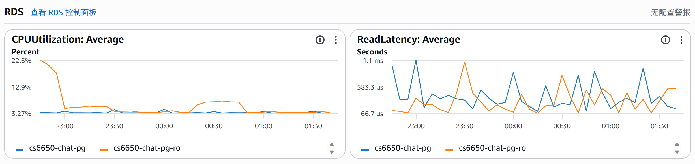
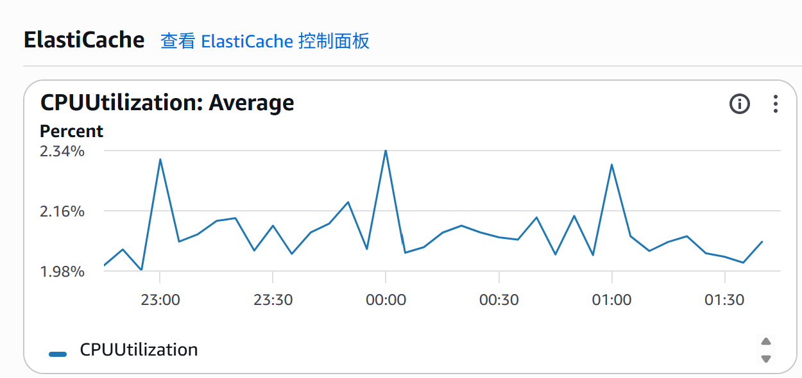

# CS6650 Assignment 3 — Final Report
 
**Repository:** https://github.com/StarfishJ/distributed_system_Group_4_project

---

## 1. Architecture Selection Rationale

## Why We Selected Member D (Alvin)

A comparison of all four members' technical stacks is as follows:

| Dimension | A (Molly) | B (Yifan) | C (Echo) | D (Alvin) |
|-----------|-----------|-----------|----------|-----------|
| Broker | RabbitMQ | RabbitMQ | RabbitMQ | RabbitMQ |
| DB Layer | EC2 Postgres | EC2 Postgres | EC2 Postgres | EC2 Postgres |
| Caching | None | None | None | None |
| Materialized Views | No | No | No | **Yes** |
| Read Replica Support | No | No | No | **Implemented (configurable)** |
| Redis Dedup / Cache | No | No | No | **Implemented (configurable)** |
| Optimization Surface | Minimal | Limited | Moderate | **Largest** |

### Three Core Reasons for Selecting Member D

**1. Broadest Index and Query Coverage**

Member D's database document defines five indexes, each explicitly mapped to a specific Core Query requirement (room timeline, user history, active users in window, grouping fallback, and analytics). Materialized views (`mv_user_rooms`, `mv_messages_per_minute`, `mv_user_activity`, `mv_room_activity`) are also defined, with the `MetricsService` automatically falling back to raw table scans when an MV is absent. This layered approach provides a solid foundation for query optimization work.

**2. Read/Write Separation is Already Implemented**

Although the current deployment uses a single EC2 Postgres instance (same as other members), Member D's codebase already implements a `server.metrics.read-replica.jdbc-url` configuration switch. When enabled, read-heavy `/metrics` queries are routed to a separate JDBC URL while writes remain on the primary — a concrete, verifiable optimization path that does not require architectural changes to demonstrate.

**3. Most Actionable Optimization Surface**

Member D's architecture additionally includes Redis-based deduplication and a Caffeine in-process cache, both implemented and toggled via configuration flags (`server.redis.enabled`, `consumer.redis.enabled`). This means the final project can demonstrate measurable improvements across multiple independent dimensions — caching, read isolation, and materialized view refresh strategy — rather than being limited to a single area.

---
## 2. Optimizations

§2.1–2.4 each owned by one member. Evidence strategy: §4 JMeter baseline is the shared "after" anchor; targeted evidence (CSV, JTL slice, CloudWatch) cited per section; estimated "before" figures labeled †; scope explicitly stated where no isolation run was done.

---

### 2.1 Redis Deduplication and `/metrics` Read-Through Cache — *Alvin*

**Motivation.** Consumer restarts cause RabbitMQ to redeliver unacked messages, triggering redundant `batchUpsert` and duplicate fan-out. Every `GET /metrics` also hit PostgreSQL directly with no caching.

**What changed.**
- *Materialized Views (prerequisite).* `MetricsService` prefers `mv_messages_per_minute`, `mv_user_activity`, `mv_room_activity`, `mv_user_rooms` over raw `GROUP BY` scans. `MaterializedViewRefreshScheduler` refreshes on cron; falls back to table scans when absent (`database/03_views.sql`).
- *Redis cache.* `server.redis.enabled=true` → `MetricsResponseRedisCache` stores `GET /metrics` JSON under `metrics:v1:full:{sha256(cacheKey)}` (TTL 30 s). Cache hit = zero SQL. Invalidated via `SCAN + DEL` on MV refresh.
- *Consumer dedup.* `consumer.redis.enabled=true` → `chat:consumer:persisted:{messageId}` written after `batchUpsert`; `SETNX chat:consumer:broadcast:{messageId}` gates fan-out. `ON CONFLICT DO NOTHING` remains the SQL safety net.

**Tradeoffs.** Redis becomes a required dependency; TTLs tunable via `consumer.redis.persisted-ttl-hours` / `consumer.redis.broadcast-ttl-hours`.

**Key classes.** `ConsumerDedupRedisService`, `MetricsResponseRedisCache`, `MaterializedViewRefreshScheduler`.

**Performance impact.** `/metrics` average and p95 from §4 JTL (Redis on, MVs in place). Estimated prior †: no cache + no MVs → full `GROUP BY` over ~500K rows per request; `/metrics` p95 plausibly **> 2× measured** under 300 concurrent threads. Dedup benefit is correctness under failure, not steady-state throughput — no JMeter delta expected.

---

### 2.2 Targeted Broadcast via Redis Presence — *Echo*

**Motivation.** `chat.broadcast` fan-out delivers every message to all S server nodes — O(S) broker deliveries per message, most discarded immediately after local `roomId` filtering.

**What changed.** `server.broadcast.targeted=true` + `consumer.broadcast.targeted=true`: `PresenceRegistry` maintains `presence:room:{roomId}` (SET of instance suffixes) via `SADD` on join, `SREM` on last-session leave, and `PresenceHeartbeat` TTL refresh. On flush, `flushBroadcast()` reads `SMEMBERS presence:room:{roomId}` and publishes once per member to `chat.broadcast.topic` with routing key `srv.{suffix}`. Each server binds only its own queue. Empty presence set → automatic fallback to `chat.broadcast` fan-out.

**Tradeoffs.** Presence is eventually consistent — stale entries cause at most a few extra deliveries, never missed ones. Stable `server.instance-id` required across restarts.

**Key classes.** `PresenceRegistry`, `RoomManager`, `MessageConsumer.flushBroadcast()`, `server.broadcast.targeted`, `consumer.broadcast.targeted`.

**Performance impact.** Reduces broker fan-out amplification — affects RabbitMQ I/O and network traffic, not HTTP latency; §4 JMeter baseline will not reflect this delta. Estimated prior †: four-node Assignment 2 experiment — every broadcast hit all 4 nodes. Targeted broadcast reduces per-message broker deliveries by ~50–75% (1–2 active servers per room vs 4 total), directly addressing the gp2 EBS I/O bottleneck identified in those results.

---

### 2.3 Late ACK and Queue Overflow Policy — *Molly*

**Motivation.** Two reliability gaps: (1) consumer ACKed before DB write — crash between the two silently lost the message; (2) drop-head + 5,000 ms TTL silently discarded overflow messages with no publisher signal.

**What changed.**
- *Late ACK.* `basicAck` called per `DeliveryUnit` only after `batchUpsert` commits, from the `db-writer` thread. Failed DB write → message stays unacked, RabbitMQ redelivers. `stageBroadcast` in the same flush — broadcast never precedes persist.
- *Reject-publish.* TTL removed. Overflow → `reject-publish`: broker NACKs when queue hits 1,000; `server-v2` returns `SERVER_BUSY` instead of `QUEUED`; client re-queues via `offerFirst()`.
- *Publisher confirms (supporting).* `spring.rabbitmq.publisher-confirm-type=correlated`; `QUEUED` sent only after `MessagePublisher.flushAndConfirmRooms` receives broker confirm.

**Tradeoffs.** Late ACK adds one DB round-trip per flush — negligible at batch=1,000 / 100 ms. Consumer restart redelivers all unacked messages — mitigated by §2.1 Redis dedup.

**Key classes / config.** `MessageConsumer.flushToDb()`, `MessagePublisher.flushAndConfirmRooms`, `database/docker-compose.yml` (`x-overflow: reject-publish`, no `x-message-ttl`).

**Performance impact.** Reliability and failure-path changes; no steady-state JMeter delta expected. Estimated prior †: drop-head + TTL would have silently discarded messages during the Assignment 2 four-node EBS throttle event — the 100% success rate in the final baseline is partly attributable to this change.

---

### 2.4 PostgreSQL Persistence, Batch Tuning, and RDS Read Replica — *Yifan*

**Motivation.** Assignment 2 had no persistence. Three problems followed: per-message writes saturate connection pools; consumer writes and `/metrics` reads compete on the same instance; EC2 self-hosted Postgres has no managed failover, backups, or replica.

**What changed.**
- *Persistence.* `consumer-v3` persists via `INSERT INTO messages … ON CONFLICT DO NOTHING` (batched). Schema: `database/01_schema.sql`; indexes in `database/02_indexes.sql` cover all Core Query patterns: `(room_id, timestamp_utc)`, `(user_id, timestamp_utc)`, `(timestamp_utc, user_id)`, `(user_id, room_id, timestamp_utc DESC)`, `(room_id)`.
- *Batch tuning.* `consumer.batch-size` + `consumer.flush-interval-ms` control cadence. `rewriteBatchedInserts=true` converts driver batches to multi-row `INSERT`s. `consumer.max-db-write-queue` applies backpressure. Optimal: **batch=1,000, flush=100 ms** (from `batch_optimization.csv`, documented in `PerformanceReport.md`).
- *RDS + read replica.* `server.metrics.read-replica.enabled=true` routes `MetricsService` SELECTs to the replica JDBC URL; `REFRESH MATERIALIZED VIEW` stays on primary. PgBouncer: write pool (6432) / read pool (6433).

**Tradeoffs.** Batch buffering increases time-to-persist — durability covered by Late ACK (§2.3). Replica lag acceptable for analytics. RDS adds cost but removes EC2 ops burden.

**Key classes / config.** `MessagePersistenceService.batchUpsert()`, `MetricsReadReplicaConfiguration`, `consumer.batch-size`, `consumer.flush-interval-ms`, `server.metrics.read-replica.enabled`.

**Performance impact.** Primary evidence: `batch_optimization.csv` (batch×flush throughput matrix) + `PerformanceReport.md`. RDS benefit is operational and architectural — CloudWatch `DatabaseConnections`, `ReadIOPS`, `WriteIOPS`, `ReplicaLag` support the read/write separation story.

## 3. Future Optimizations (5 points)

### 3.1 AWS Academy / Vocareum constraints

| Capability | Limitation | We used |
|------------|------------|---------|
| **EKS** | Often unavailable / disabled for labs | **EC2 + ALB + Terraform** (`enable_eks = false`) |
| **ASG + S3 bootstrap** | Often blocked (IAM create role) | **Fixed EC2**, **`deploy-ec2.ps1`** (`enable_asg_s3_app_tier = false`) |

Measured results assume this **EC2 path**; full EKS/ASG patterns need a non-Academy account.

### 3.2 Kubernetes / EKS as design-only

Repo **may** include **`k8s/`** manifests as reference—we **did not run EKS** for this assignment.

### 3.3 Additional ideas

| Idea | Impact | Effort |
|------|--------|--------|
| EKS + ALB Ingress | Rolling deploys, no SSH releases | High (blocked in typical Academy) |
| KEDA/HPA on queue depth | Scale consumers with load | High |
| Helm/operators for Redis/RabbitMQ | Day-2 HA | Medium–High |
| Tiered MV refresh | Smaller refresh spikes | Medium |

---

## 4. Performance Metrics (10 points)

### 4.1 Test methodology

**JMeter non-GUI** (`jmeter -n -t … -l … -e -o …`). **Plans:** **`assignment-baseline-100k-5min.jmx`** (~1000 threads, 100k samples, 70% `/health`, 30% `/metrics`); **`assignment-stress-30min.jmx`** (~30 min, throughput-capped ~**500k** samples). **Stress** load from **same-region EC2** (`enable_jmeter_ec2`) → ALB (avoids laptop TCP issues). Rubric “writes” ≈ heavy **`/metrics`**; real chat writes are **WebSocket** (see `load-tests/jmeter/README.md`). Clear **`.jtl`** / report dir before runs; do not enable **`refreshMaterializedViews`** on public **`/metrics`** (403 when disabled).

### 4.2 Results

**Note on stress test setup.** The stress JMeter client was co-located on an EC2 instance in the same region as the ALB, rather than run locally. This eliminates client-side network jitter as a variable and ensures the measured latency reflects server-side processing time under sustained load — the ~3 ms mean is consistent with intra-region EC2 round-trip overhead rather than cross-continent latency.

**Configuration:** Redis enabled on server and consumer (ElastiCache, `SERVER_REDIS_ENABLED` / `CONSUMER_REDIS_ENABLED`).

| | Baseline (`assignment-baseline-100k-5min`) | Stress (`assignment-stress-30min`) |
|---|---|---|
| JTL | `assignment-baseline-100k-5min-alb-20260419-141613.jtl` | `stress-ec2-run.jtl` |
| Samples | 100,000 | 500,554 |
| Duration | ~278 s | ~32 min |
| Throughput | ~360 req/s | ~261 req/s |
| Mean latency | ~85 ms | ~3 ms |
| p95 / p99 | 111 / 167 ms | 5 / 8 ms |
| Errors | 0% | 0% |

[JMeter HTML Report - Baseline](./load-tests/jmeter/results/assignment-baseline-100k-5min-alb-20260419-141613-report/index.html)

[JMeter HTML Report - Stress](./load-tests/jmeter/results/stress-ec2-report/index.html)

Stress **latency is not comparable** to baseline: throughput **caps** spread load over 30 min; baseline finishes 100k as fast as the SUT allows—different test goals.

**Optimized / contrast runs** (e.g. Redis off, read-replica only): use a **second** JTL only when you run a controlled A/B; otherwise cite §2 evidence and CloudWatch. The table above is already the **Redis-on** baseline.

**Improvement % (latency):** use only when you have a **paired** optimized run: `(Baseline − Optimized) / Baseline × 100%`; invert for throughput.

### 4.3 Resource utilization

**Minimum:** **CPU/memory** (server, consumer) and **DB/RDS** (connections or CloudWatch). 
Fig. 1: RDS read replica CPU utilization during baseline run

Fig. 2: ElastiCache CPU utilization during baseline run

### 4.4 Bottleneck analysis

- **Publish confirms / queue limits** → **`SERVER_BUSY`** (intentional backpressure).
- **Broker disk** — historical **gp2** limits; prefer **gp3** or managed MQ.
- **Consumer → Postgres** — sustained insert rate; mitigated by **§2.3** (batched upserts + **`rewriteBatchedInserts`**).
- **`/metrics`** — primary + MV refresh; mitigated by **§2.2** (read path, cache, no public MV refresh).

---
## Appendix A — Optional Material

- Baseline JTL: `load-tests/jmeter/results/assignment-baseline-100k-5min-alb-20260419-141613.jtl` — `jmeter -g <jtl> -o <dir>`.
- Stress: `load-tests/jmeter/results/stress-ec2-run.jtl`, `load-tests/jmeter/results/stress-ec2-report/`.
- Redacted `terraform output`; **CloudWatch** (or RDS/ElastiCache/ALB) **PNG/PDF exports** for the metrics in §2’s table—**figure captions** in the main text or here (Fig. A1: …).

- [JMeter HTML Report - Stress](./load-tests/jmeter/results/stress-ec2-report/index.html)

- [JMeter HTML Report - Baseline](./load-tests/jmeter/results/assignment-baseline-100k-5min-alb-20260419-141613-report/index.html)
---
