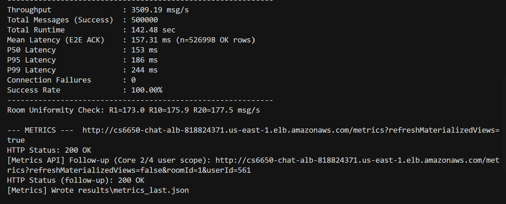
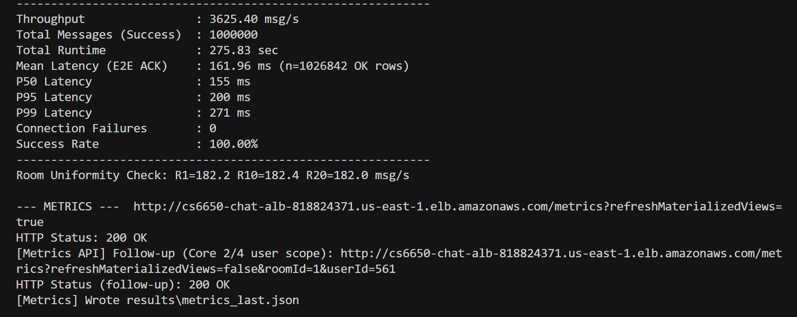
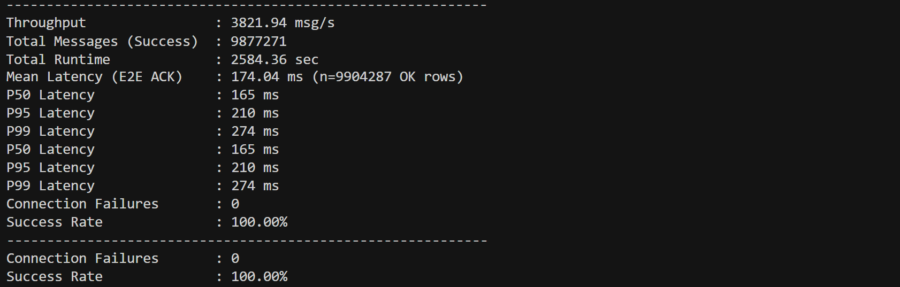
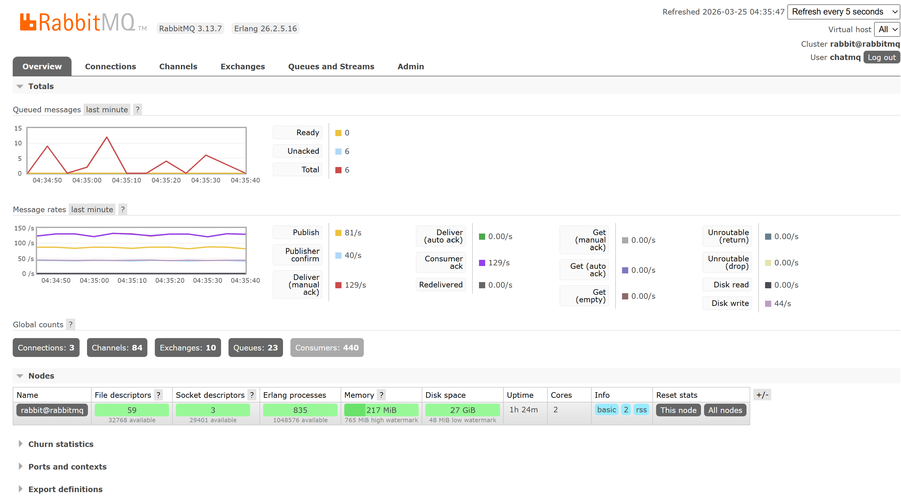
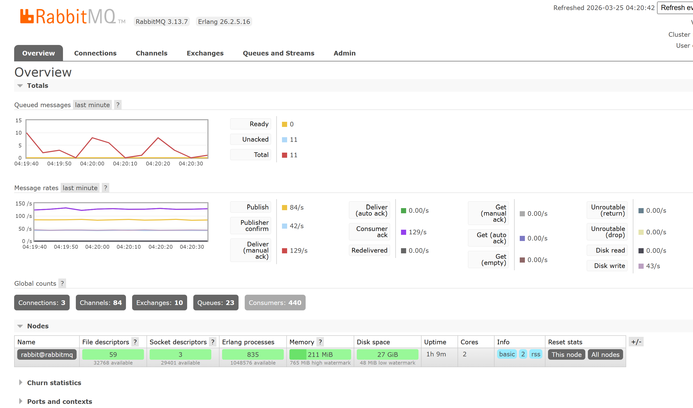
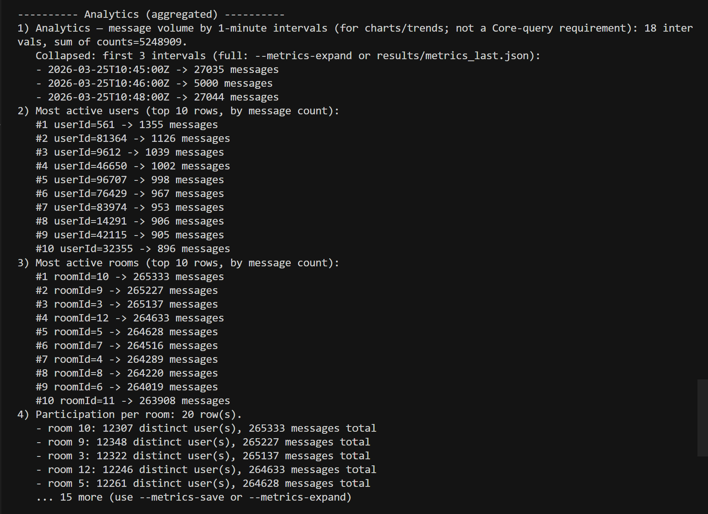

# CS6650 Assignment 3 — Performance Report

**Test setup:** `client_part2` → **ALB** (`cs6650-chat-alb-818824371.us-east-1.elb.amazonaws.com`); backend **server-v2 + consumer-v3 + PostgreSQL + RabbitMQ** on AWS (same assignment stack). Latencies from **`per_message_metrics.csv`** (OK rows only), printed in the client summary after each run.

---

## 1. Write performance

### 1.1 Maximum sustained write throughput

| Test | Messages | Throughput (msg/s) | Runtime (s) | Success rate |
|------|----------|----------------------|-------------|--------------|
| **Baseline** | 500,000 | **3,509.19** | **142.48** | **100%** |
| **Stress** | 1,000,000 | **3,625.40** | **275.83** | **100%** |
| **Endurance** | **9,877,271** (completed) | **3,821.94** | **2,584.36** (~43 min total) | **100%** |

**Environment:** AWS (ALB → WebSocket server; RabbitMQ; PostgreSQL on EC2). Client driver: Windows, `client_part2` JAR.

**Load balance across rooms (client “Room Uniformity Check”):**

| Run | R1 (msg/s) | R10 (msg/s) | R20 (msg/s) |
|-----|------------|-------------|-------------|
| 500k | 173.0 | 175.9 | 177.5 |
| 1M | 182.2 | 182.4 | 182.0 |
| Endurance 30m | 190.8 | 190.8 | 191.2 |

Even spread across 20 rooms; slight variance is normal.

**Throughput / totals / room uniformity:** the **numbers in the tables above** come from the **`ASSIGNMENT 2 PERFORMANCE REPORT SUMMARY`** block in the **`client_part2` terminal** after each run (not from `GET /metrics`).

**Figure 1 — Client terminal after load test** (`results/50w/metrics.png`, `results/100w/metrics.png`): use these if your capture includes that **summary block** (throughput, message counts, mean/P50/P95/P99, room uniformity). **`Core.png` is different** — it shows **Core queries 1–4** from **`GET /metrics`**; those images are under **§4**.

---

### 1.2 Latency percentiles (end-to-end client ACK)

Measured by **client_part2** (send → server ACK until status response). Source: **`per_message_metrics.csv`** after `shutdownCsvWriter()`, **status=OK** rows (`n` = count of rows used for percentiles).

| Metric | Baseline (500k) | Stress (1M) | Endurance (30m + drain) |
|--------|-----------------|-------------|---------------------------|
| **n (OK rows in CSV)** | 526,998 | 1,026,842 | 9,904,287 |
| **Mean** | 157.31 ms | 161.96 ms | **174.04 ms** |
| **P50** | 153 ms | 155 ms | **165 ms** |
| **P95** | 186 ms | 200 ms | **210 ms** |
| **P99** | 244 ms | 271 ms | **274 ms** |

**Endurance note:** client summary **Total Messages (Success) = 9,877,271** matches completed sends; **n** for percentiles counts **OK rows in `per_message_metrics.csv`** for that run (slightly higher — e.g. async CSV vs counter timing); use the summary **success count** as the canonical **completed message** total.

Higher means vs purely local Docker runs reflect **ALB + cross-AZ / WAN RTT** and shared cloud resources. The endurance mean/P99 are a bit above 500k/1M partly due to **longer run** and **deep queue drain** phase.

**Figure 2 — Latency:** values are in the **table above**; if **Figure 1** (`metrics.png`) includes the same percentile lines from the client summary, it duplicates that evidence. *(Optional: add a histogram from `per_message_metrics.csv` later.)*

---

### 1.3 Batch size optimization

Matrix: batch size × flush interval (50k msgs/run). Results recorded under `load-tests/results/batch_optimization.csv` (when script completed).

| batch_size | flush 100 ms | flush 500 ms | flush 1000 ms |
|------------|--------------|--------------|---------------|
| 100 | ~2,606 | ~2,727 | ~2,525 |
| 500 | ~2,608 | ~2,579 | ~2,462 |
| **1000** | **~2,764** | ~2,649 | ~2,631 |
| 5000 | ~2,617 | ~2,750 | ~2,540 |

**Chosen production settings:** `consumer.batch-size=1000`, `consumer.flush-interval-ms=100`  
**JDBC:** `rewriteBatchedInserts=true` on PostgreSQL URL (~2–3× batch insert improvement in testing).

---

### 1.4 Resource utilization

| Metric | Evidence (submission) | Notes |
|--------|------------------------|--------|
| DB / host CPU & memory | **`results/50w/CPU & Memory.png`**, **`results/100w/CPU & memory.png`** | Captured during load (e.g. `htop` / host metrics) |
| Message broker | **`results/50w/MQ.png`**, **`results/100w/MQ.png`** | RabbitMQ management / queue view |
| Core / terminal metrics | **`results/50w/Core.png`**, **`results/100w/Core.png`** | Client summary / Core query output |
| Analytics / API | **`results/50w/Analytical.png`**, **`results/100w/Analytical.png`** | Metrics / analytics slice |
| Extra | **`results/50w/metrics.png`**, **`results/100w/metrics.png`** | Additional metrics capture |
| Active DB connections | `monitoring/postgres-snapshot.sql` | Pool max 10, min 2 in consumer-v3 |

**Figure 3 — Host CPU & memory (database / EC2 during load):**

**Figure 4 — RabbitMQ / queue depth (same runs):**

**Figure 5 — Analytics / `/metrics` console (aggregated slice):**

---

## 2. System stability

### 2.1 Queue depth over time

**Figures:** same as **Figure 4** (`results/50w/MQ.png`, `results/100w/MQ.png`) — RabbitMQ management / queue view during baseline and stress.

**Target (design):** keep broker queue depth bounded; consumer uses prefetch and DB backpressure (`max-db-write-queue`) to avoid unbounded RAM growth.

**Observed:** Queue depth stayed **bounded** during 500k/1M runs (no runaway backlog in the RabbitMQ captures). After the load client stopped, depth **drained** as expected — the broker did not act as an infinite buffer. For the **30 min endurance** run, the client briefly held **~2.2M** messages in its own queues while the generator was faster than the steady-state completion rate; that backlog was **client-side**, not RabbitMQ unbounded growth.

---

### 2.2 Database performance metrics

PostgreSQL remained the **durability bottleneck** under sustained writes (consumer batch inserts). We did not ship a separate pgAdmin screenshot for **`pg_stat_statements`**; instead we ran **`monitoring/postgres-snapshot.sql`** on the **Postgres EC2** (copy script to `/tmp`, then `sudo -u postgres psql -d chatdb -f /tmp/postgres-snapshot.sql` so the `postgres` OS user can read the file).

**Measured snapshot** (single sample; **post–load**, not mid–peak throughput):

| Field | Value | Notes |
|--------|--------|--------|
| **Time (UTC)** | 2026-03-26 05:02:32 | Wall-clock of `SELECT now()`. |
| **`COUNT(*)` from `messages`** | **11,244,976** | Total rows at snapshot time (includes all prior runs + endurance). Slightly above `n_live_tup` below (~48k) due to stats snapshot timing / vacuum counters. |
| **`xact_commit` / `xact_rollback`** | **52,271 / 0** | **Zero rollbacks** — consistent with successful batch inserts and `ON CONFLICT DO NOTHING` for idempotency. |
| **`buffer_hit_pct`** | **96.34%** | High buffer hit rate on a warm instance; read traffic served mostly from shared buffers. |
| **`blks_hit` / `blks_read`** | 275,836,548 / 10,468,731 | Cumulative since stats reset; ratio aligns with **96.34%** hit rate. |
| **`pg_stat_activity`** | **1** session in `active` | Idle-period sample; during a live load, expect more backends (≤ Hikari max on consumers). |
| **`messages.n_live_tup` / `n_dead_tup`** | **11,240,147 / 0** | Large live row count; **no dead-tuple backlog** at sample time. |
| **`last_autovacuum`** | 2026-03-25 20:37:17 UTC | Autovacuum ran recently; heap maintenance is automatic. |

**Interpretation:** The database stayed healthy after heavy ingest: **high cache hit ratio**, **no transaction rollbacks** in this database-level counter, and **autovacuum** active on `messages`. **Lock waits** were not investigated in a separate capture; append-heavy writes to one hot table with our index set did not require a lock-focused figure for this submission. Heavy **read** work for `/metrics` is mitigated with **materialized views** and **cached** metrics where configured.

---

### 2.3 Memory usage patterns

**Figures:** **Figure 3** (`results/50w/CPU%20%26%20Memory.png`, `results/100w/CPU%20%26%20memory.png`) — host view (e.g. `htop` / top) on the **database EC2** during baseline and stress.

**What to look for in the captures:** **RSS** for the `postgres` process grows with cache + connections but should **plateau** once the buffer pool is warm; **no OOM** and no swap thrashing under our sustained **~3.5–3.8k msg/s** client-observed throughput. **User vs system** CPU split: elevated **user** time is expected under insert-heavy load; spikes in **system** may indicate I/O (WAL, checkpoints).

**Other processes on the same host:** If the screenshot includes the full machine, **Java** (consumer) may appear on the DB VM only in smaller deployments; in our Terraform layout, **consumer** is often a **separate EC2**, so its JVM heap is bounded separately (`-Xmx`). **RabbitMQ** (Docker on another instance) uses its own memory watermark — see **Figure 4** for broker-level health, not Figure 3.

**Endurance note:** The long run increased **total rows** in `messages` and thus **DB footprint** over time; memory charts for 500k/1M are still valid as **representative** load snapshots. A post–endurance snapshot would show a larger `messages_rows` count in `postgres-snapshot.sql`.

---

### 2.4 Connection pool statistics

| Setting | Value (consumer-v3) |
|---------|---------------------|
| Hikari `maximum-pool-size` | 10 |
| Hikari `minimum-idle` | 2 |

**Observed DB connections (sample):** `postgres-snapshot.sql` at **2026-03-26** showed **one** `active` backend to `chatdb` — taken **between** load tests, not under peak concurrency. During a live run, the **consumer**’s Hikari pool (max **10**) drives concurrent DB sessions; expect **higher** `pg_stat_activity` counts if the snapshot is taken while the client is hammering the stack.

---

## 3. Bottleneck analysis

### Primary bottlenecks identified

1. **End-to-end pipeline:** WebSocket + RabbitMQ + consumer DB writer — sustained **~3.5–3.8k msg/s** through ALB in measured runs (500k / 1M / **~30 min endurance ~3.82k msg/s** average over full run including drain); next limits are typically **PostgreSQL commit rate**, **single consumer instance**, or **network RTT**.  
2. **Network / RTT:** Client E2E latency **mean ~157–162 ms** (P50 ~153–155 ms) reflects **internet + ALB + AWS path**, not local loopback.

### Proposed solutions

- Scale **horizontally:** multiple consumer instances with **room partitioning** (`consumer.rooms=1-5`, etc.).  
- **DB:** larger batch + `rewriteBatchedInserts`, connection pool tuning, later read replica for `/metrics`.  
- **Broker:** increase consumers / prefetch only if DB keeps up (avoid hiding DB overload).

### Trade-offs

| Decision | Trade-off |
|----------|-----------|
| Batch 1000 / flush 100 ms | Slightly higher latency per batch vs smaller batches; best throughput in matrix |
| `rewriteBatchedInserts` | Driver-specific; excellent for Postgres |
| Circuit breaker (5 fails, 30 s open) | Brief write stall vs protecting DB from retry storms |
| Materialized views + refresh | Fresh analytics cost vs fast reads |

---

## 4. Metrics API & results log

After each load test, the client calls **`GET /metrics`** (with **`refreshMaterializedViews=true`** on the first request when enabled). A second request may supply a real **`userId`** so Core 2 / Core 4 are non-empty under synthetic load (see `client_part2` behavior). **After the ~9.88M endurance run, that refresh request via ALB returned 504** (gateway timeout); for screenshots or logs use **`--no-refresh-mviews`**, query **`/metrics`** without refresh, or call from **inside VPC** with a longer timeout.

**Visual evidence:** **`results/50w/Core.png`**, **`results/50w/Analytical.png`**, **`results/50w/metrics.png`** and the **`results/100w/`** counterparts show the console / API summary for each run.

**Illustrative API values** (depend on DB contents and time window; yours will differ as the table grows):

| Area | Example interpretation |
|------|-------------------------|
| Core 1 | Up to 1000 room messages in `[start,end]` for `roomId` |
| Core 2 | Up to 500 rows of user history across rooms |
| Core 3 | `COUNT(DISTINCT user_id)` in window — **required scalar** |
| Core 4 | List of `{ roomId, lastActivity }` for the **queried** `userId` |

**Figure 6 — Full `/metrics` log:** **Core** (embedded above), **Analytical** (**Figure 5**), and **`metrics.png`** (**Figure 1**) together document the API + terminal output per run.

**Machine-readable:** `results/metrics_last.json` (overwritten by the **last** client run; use **`--results-tag`** + `results/<tag>/metrics_last.json` to keep 500k vs 1M side by side).

---

## 5. Configuration summary (submission)

| Topic | Location |
|-------|----------|
| DB URL, pool, batch, retry, circuit breaker | `consumer-v3/src/main/resources/application.properties` |
| Server DB pool, RabbitMQ, resilience4j | `server-v2/src/main/resources/application.properties` |
| Client workers / rooms | `client/client_part2/src/main/resources/client.properties` |
| Index / DDL | `database/02_indexes.sql`, `01_schema.sql` |

Detailed index: `configuration/README.md`.

---

## Appendix — Figure index (embedded above)

| # | File(s) | Section |
|---|---------|---------|
| 1 | `metrics.png` (50w / 100w) | §1.1 — client terminal after run (summary block if present) |
| 2 | *(table + optional Fig 1)* | §1.2 — latency percentiles |
| 3–4 | `CPU & Memory.png` / `CPU & memory.png` (URL-encoded in §1.4) | §1.4, §2.3 |
| 4 (queue) | `MQ.png` (50w / 100w) | §1.4, §2.1 |
| 5 | `Analytical.png` (50w / 100w) | §1.4 |
| 6 | `Core.png` (50w / 100w) + cross-ref 1, 5 | §4 — **`GET /metrics` Core 1–4** |
| 7–8, 10 | *(Not submitted as images; see §2.2 / §2.4.)* | §2.2, §2.4 |
